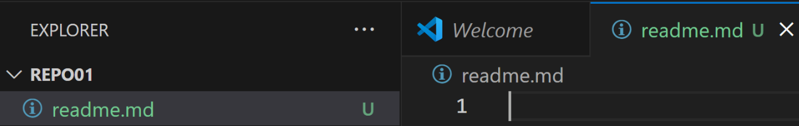

# Creacion del repositorio Git
1.1 – Crea un directorio llamado repo01 en local (desde tu máquina) e ejecuta el comando
pertinente para que dicho directorio para que se transforme el repositorio en local 
¿Cómo podemos identificar que el repositorio se ha inicializado?
***

***Para inicializar el repositorio utilizaremos el comando git init, dentro del mismo, en esta imagen podemos ver que ya tenía el repositorio creado.***

***Con el comando git status podemos ver el estado de nuestro git y nos mostrará los commits realizados.***

1.2 – Añade un documento llamado readme.md dentro del repositorio (recuerda que MD es la extensión de los ficheros Markdown) y documenta en su interior todos los pasos que vas realizando para crear un repositorio, etc. 
Puedes añadir fotos o lo que creas conveniente
***
***En mi caso he accedido al repositorio desde visual studio code abriéndolo desde la consola con: code . y he creado el archivo readme.md para comenzar a documentar los pasos.***

1.3 – Añade el fichero que acabamos de añadir al repositorio al staging área, visualiza el estado del repositorio (con git status) y haz un snapshot (commit) del fichero hacía nuestro repositorio local. ¿En qué “file status lifecycle” se encuentra el fichero?
***
***Abro la consola utilizando Ctrl+Ñ para poder utilizar los comandos y utilizo el git status para ver el estado del repositorio***

***He realizado el git add . para añadir todos los elementos del repositorio  y posteriormente un git status para mostrar el estado de los archivos del repositorio***

***Una vez añadimos los archivos del repositorio utilizamos el comando git commit -m "Texto" para almacenar los archivos en el repositorio y poder hacer un push a continuación.***

***
□ 1.4 – Intenta subir los ficheros al repositorio remoto mediante al comando git push ¿Se te ocurre que
está pasando? (si no lo sabes aún no te preocupes)
***
***Utilizo el comando git push --set-upstream . master para hacer el push y almacenar los archivos en el repositorio remoto pero no deja al no tener vinculada la rama.***

1.5 – Ejecuta el comando git remote –v e investiga porque no nos aparece nada
***
***Ejecutando el comando git remote -v nos aparece esto en la consola ya que el -v es un subcomando desconocido y nos aparecen el resto de comandos que si pueden funcionar***

1.6 – Crea un repositorio remoto llamado repo01, asócialo a tu repositorio local
***
***He creado el repositorio en GitHub para poder subir los archivos al repositorio remoto***

1.7 – Vuelve a ejecutar el comando git remote –v nuevamente y explica el porque ahora si que aparece
