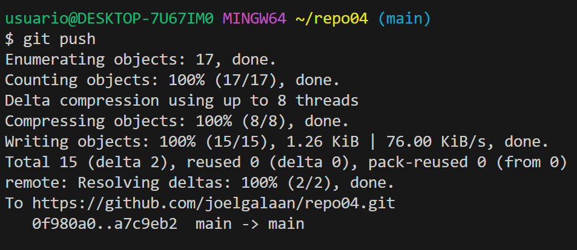

# Creacion del repositorio Git
1.1 – Crea un directorio llamado repo01 en local (desde tu máquina) e ejecuta el comando
pertinente para que dicho directorio para que se transforme el repositorio en local 
¿Cómo podemos identificar que el repositorio se ha inicializado?
***

***Para inicializar el repositorio utilizaremos el comando git init, dentro del mismo, en esta imagen podemos ver que ya tenía el repositorio creado.***

***Con el comando git status podemos ver el estado de nuestro git y nos mostrará los commits realizados.***

1.2 – Añade un documento llamado readme.md dentro del repositorio (recuerda que MD es la extensión de los ficheros Markdown) y documenta en su interior todos los pasos que vas realizando para crear un repositorio, etc. 
Puedes añadir fotos o lo que creas conveniente
***
***En mi caso he accedido al repositorio desde visual studio code abriéndolo desde la consola con: code . y he creado el archivo readme.md para comenzar a documentar los pasos.***

1.3 – Añade el fichero que acabamos de añadir al repositorio al staging área, visualiza el estado del repositorio (con git status) y haz un snapshot (commit) del fichero hacía nuestro repositorio local. ¿En qué “file status lifecycle” se encuentra el fichero?
***
***Abro la consola utilizando Ctrl+Ñ para poder utilizar los comandos y utilizo el git status para ver el estado del repositorio***

***He realizado el git add . para añadir todos los elementos del repositorio  y posteriormente un git status para mostrar el estado de los archivos del repositorio***

***Una vez añadimos los archivos del repositorio utilizamos el comando git commit -m "Texto" para almacenar los archivos en el repositorio y poder hacer un push a continuación.***

***
□ 1.4 – Intenta subir los ficheros al repositorio remoto mediante al comando git push ¿Se te ocurre que
está pasando? (si no lo sabes aún no te preocupes)
***
***Utilizo el comando git push --set-upstream . main para hacer el push y almacenar los archivos en el repositorio remoto pero no deja al no tener vinculada la rama por utilizar el nombre master.***

1.5 – Ejecuta el comando git remote –v e investiga porque no nos aparece nada
***
***Ejecutando el comando git remote -v nos aparece este error porque no tenemos el repositorio local vinculado de forma remota***

1.6 – Crea un repositorio remoto llamado repo01, asócialo a tu repositorio local
***
***He creado el repositorio en GitHub para poder subir los archivos al repositorio remoto***

1.7 – Vuelve a ejecutar el comando git remote –v nuevamente y explica el porque ahora si que aparece
***
***Ahora al utilizar git remote -v podemos observar como se muestran los dos repositorios creados***

1.8 – Sube los cambios que hemos subido al snapshot local (commit) hacía al repositorio remoto
***Utilizaremos el comand git commit -am "TEXTO" para realizar un commit y un push en un solo comando. 

□ 1.9 – Ves al repositorio remoto (en este caso GitHub) y comprueba que se haya realizado
***
***Esta todo publicado en el repositorio remoto y local de forma correcta.

2.1 - Crea un repositorio llamado repo02 desde GitHub. ¿Sería considerado un repositorio
local o remoto?
***
***Este repositorio es remoto ya que no esta en mi maquina de forma local***

2.2 – Posteriormente, clónalo (mediante al comando git clone), lo que realizará una copia
del repositorio remoto en nuestro equipo, creando con ello un repositorio local a partir del
repositorio en remoto
***
***Utilizando el comando git clone y el enlace del repositorio creamos un clonacion del repositorio a la maquina local.***

2-3 - Añade un fichero readme.md y ejecuta los comandos pertinentes hasta llegar a poder
realizar un commit.
***
***He utilizado git add . para añadirlo y a continuación he utilizado el commit -am "Texto" para hacer el push

2.4 – Entra en este manual de Markdown y haz un resumen de los principales comandos de
Git con los que hemos trabajando. Puedes utilizar tablas, imágenes, títulos, enlaces, etc.
***
|[Comandos Utilizados en el ejercicio](https://medium.com/@davidbernalgonzalez/3-markdown-c82d88c1d222) | | | 🤯 |
|:--- |:---- |:----:| ----:|
|1. Git Status| Estado de archivos en el git
|2. Git Add   | Añadir archivos para realizar un commit
|3. Git Commit -m "Texto"  |  Actualizar archivos para poder realizar un push y poder subirlos a la repositorio remoto
|4. Git Push --set-upstream . main  | Para subir los archivos al repositorio remoto
|5. Git Remote -v | Para ver los directorios remotos que disponemos
|6. Git Clone | Para realizar una clonación de un repositorio remoto en la maquina local.

***
4.1 – Crea un directorio llamado repo04, esta vez tu decides como lo haces. Es decir, tendrás que
seleccionar uno de los dos caminos que hemos visto en los dos ejercicios anteriores. Pero si que
queremos que exista el repositorio el local y en remoto.
***
***He creado el directorio a traves de GitHub y he realizado una clonacion después para almacenarlo de forma local y poder trabajar con el.***

4.2 – Añade un fichero readme.md vacío al repositorio local, ejecuta los comandos pertinentes para
realizar un commit y finalmente, sube los cambios al repositorio remoto que tendrá el mismo nombre
repo04.
***

***He creado el readme.md y he realizado el git add . y git commit -m "texto" para subirlo al repositorio remoto.***
4.3 – Crea una rama con tu nombre y la fecha actual (por ejemplo en mi caso la rama se llamará
david02032022) desde la cual editaremos el fichero
***

4.4 – Desde tu rama (david02032022) edita el fichero readme.md de tal forma que quede de la siguiente
manera:
***

***

4.5 – Haz 3 commits desde nuestra rama (david02032022)
***

***He realizado varias cambios des de la nueva rama.***

4.6 – En el siguiente orden realiza lo siguiente:
___
□ 4.6.1 – Fusiona tu rama con master

***Una vez realizo la fusion desde la rama main me aparecen los cambios realizados desde la rama externa en la que los he realizado
___

□ 4.6.2 – Haz un push hacía la nube

*** 
4.7 – Elimina solamente la rama en local david02032022 ya que si eliminásemos la remota no veríamos la
rama en remoto.
***

***Con el comando git branch -d (nombre rama) eliminariamos la rama que queremos.
4.8 - Visualiza el resultado tanto mediante el comando git log --all --oneline -decorate –graph, como
desde el pluging de VSC
***
***git log --all --oneline -decorate –graph***

5.1 – Crea un directorio llamado repo05, esta vez tu decides como lo haces. Es decir, tendrás que
seleccionar uno de los dos caminos que hemos visto en los dos ejercicios anteriores. Pero si que
queremos que exista el repositorio el local y en remoto.
***

5.2 – Crea el fichero readme.md
***

5.3 - Crea una rama con tu nombre y la fecha actual (por ejemplo en mi caso la rama
□ se llamará david02032022) y sitúate en dicha rama
***

***Con el comando git branch (nombre rama) crearemos la rama.
Con el comando git checkout (nombre rama) cambiaremos a la rama que queramos***
5.4 – Haz 3 commits en la rama (david02032022)

5.5 – En este caso, antes de hacer el merge sube ambas ramas al repositorio remoto. Verifica que se hayan subido correctamente. Lo hacemos así, ya que cuando realicemos el merge si nos equivocamos podemos volver a clonar el repositorio sin necesidad de tener que volver a comenzar el ejercicio de 0.
***

5.6 – Basándote en el ejemplo que hemos visto anteriormente, realiza un commit no fast-forward en el que mergearemos la rama david02032022 con main.
***

5.7 – Visualiza el resultado tanto mediante el comando git log --all --oneline --decorate --graph, como desde el pluging de VSC
***

5.8 – Explica las diferencias entre un merge FF y un merge no FF
***
***En el caso del merge Fast Forward seria que la rama  apunta hacia un mismo destino en cambio  merge no FastForward pasa por otras variaciones hasta llegar a un destino final.

EJERCICIO 6: GIT
□ Haz un alias con la finalidad de que cuando escribamos el comando git log adog nos ejecute lo
siguiente:
***
□ Manera 1: a partir del fichero .gitconfig situado en el directorio ~
***
Manera 2: utilizado el comando de alias desde una terminal
***
***Para realizar un atajo con alias deberemos utilizar el siguiente comando para hacerlo a traves del terminal.***

git config --global alias.adog "log --all --decorate --oneline --graph"

Realiza las instrucciones definidas en el siguiente
***

1
2
3